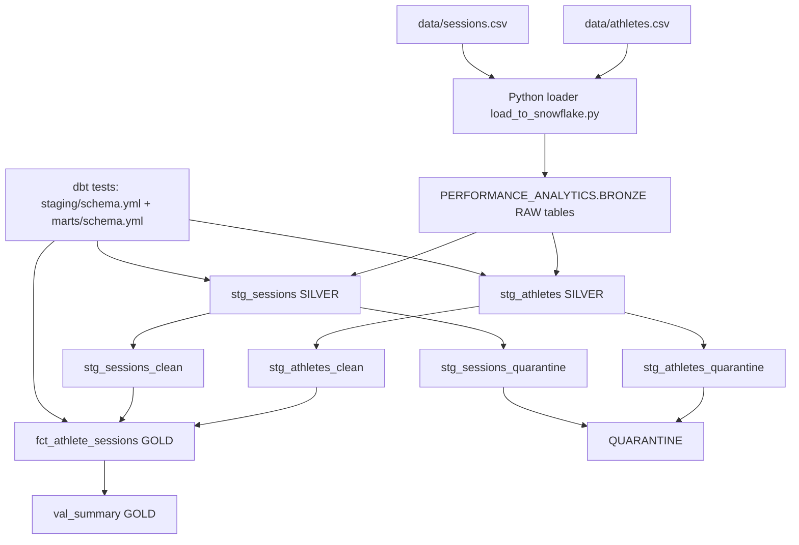
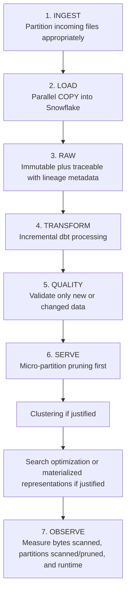

## AthleteSessionAssessment — Snowflake ELT + dbt

This repository implements a focused ELT pipeline that:

- lands raw CSV payloads into a Snowflake `BRONZE` landing schema
- validates and normalizes rows in dbt-managed `SILVER` staging models
- isolates bad rows into a `QUARANTINE` schema for audit and triage
- produces analytics-ready `GOLD` marts and a fact table for reporting

### Project scope

Source files:

- `data/athletes.csv`
- `data/sessions.csv`

Primary outputs:

- `PERFORMANCE_ANALYTICS.GOLD.CLEAN_SESSIONS` — cleaned fact table joining athletes and sessions (the actual GOLD session mart; `FCT_ATHLETE_SESSIONS` is referenced elsewhere in older parts of this doc but does not exist as a model)
- `PERFORMANCE_ANALYTICS.GOLD.VAL_SUMMARY` — run-level validation summary and counts (real as of `dbt_project/models/marts/val_summary.sql`)

### Repository contents (actual)

- `DECISIONS.md` — design decisions (includes quarantine rationale)
- `requirements.txt` — Python dependencies
- `rsa_key.p8`, `rsa_key.pub` — example keypair (private key path used by Snowflake auth)
- `data/` — example CSV inputs
- `dbt_project/` — dbt project containing models, macros, and `profiles.yml`
- `src/` — Python orchestration and helpers:
  - `src/load_to_snowflake.py` — ingestion: PUT/COPY local CSVs to the BRONZE landing stage and `COPY INTO` BRONZE raw tables
  - `src/run_dbt_pipeline.py` — run dbt build/tests and summarize results
  - `src/snowflake_conn.py` — central Snowflake connection and private-key handling
  - `src/manage_schemas.py` — list and drop schemas helper

### dbt model → file mapping (current project)

- `stg_athletes` ← `dbt_project/models/staging/stg_athletes.sql`
- `stg_athletes_clean` ← `dbt_project/models/staging/stg_athletes_clean.sql`
- `stg_athletes_quarantine` ← `dbt_project/models/staging/stg_athletes_quarantine.sql`
- `stg_sessions` ← `dbt_project/models/staging/stg_sessions.sql`
- `stg_sessions_clean` ← `dbt_project/models/staging/stg_sessions_clean.sql`
- `stg_sessions_quarantine` ← `dbt_project/models/staging/stg_sessions_quarantine.sql`
- `clean_sessions` ← `dbt_project/models/marts/clean_sessions.sql` (the actual GOLD session mart — `fct_athlete_sessions` is referenced in older parts of this doc but no such model exists in this project)
- `val_summary` ← `dbt_project/models/marts/val_summary.sql`

### End-to-end architecture (summary)

Responsibilities are separated for clarity and operational safety:

- Ingestion (Python) — `src/load_to_snowflake.py` loads files into a landing stage and copies into `BRONZE` raw tables, adding lineage columns (`_source_file`, `_source_row_number`, `_loaded_at`).
- Transformation (dbt) — `dbt_project/` contains staging and mart models; staging produces `*_clean` and `*_quarantine` outputs; marts build the `GOLD` artifacts.
- Quarantine/Audit — bad rows are reason-coded and written to `QUARANTINE` for manual review; the consolidated `stg_quarantine_records` model remains in the repo but is disabled.

Mermaid view (simplified):



Pipeline summary:

- `src/load_to_snowflake.py` performs ingestion only; dbt performs validation, transformation, and testing.
- dbt schema tests in `dbt_project/models/staging/schema.yml` (`unique`/`not_null` on `stg_athletes`, `unique`/`not_null`/`relationships`/`accepted_values` on `stg_sessions`) and `dbt_project/models/marts/schema.yml` (`not_null`/`unique`/`relationships` on the GOLD mart) enforce data contracts at each layer.
- The `QUARANTINE` schema preserves rejected rows with `failure_reason` for triage.
- `val_summary` aggregates run-level validation metrics and serves as a lightweight observability artifact.

### Prerequisites

1. Snowflake account and user with permissions to create/use:
   - database: `PERFORMANCE_ANALYTICS`
   - schemas: `BRONZE`, `SILVER`, `QUARANTINE`, `GOLD`
2. Python 3.13+ recommended.
3. Local private key for Snowflake JWT auth.

### Environment Setup

From repo root:

```bash
/opt/homebrew/bin/python3.13 -m venv .venv
source .venv/bin/activate
python -m pip install --trusted-host pypi.org --trusted-host files.pythonhosted.org -r requirements.txt
python -m pip install --trusted-host pypi.org --trusted-host files.pythonhosted.org dbt-core dbt-snowflake
```

Create `.env` in repo root:

```dotenv
SNOWFLAKE_USER=<your_user>
SNOWFLAKE_ACCOUNT=<your_account>
SNOWFLAKE_ROLE=ACCOUNTADMIN
SNOWFLAKE_WAREHOUSE=COMPUTE_WH
SNOWFLAKE_PRIVATE_KEY_PATH=~/.snowflake/rsa_key.p8
```

### Fresh Start Run

Run full pipeline:

```bash
source .venv/bin/activate
python src/load_to_snowflake.py
python src/run_dbt_pipeline.py
```


### Verify in Snowflake

Use this sequence to validate BRONZE ingestion quality before reviewing SILVER and GOLD.

```sql
USE DATABASE PERFORMANCE_ANALYTICS;
SHOW SCHEMAS;

USE SCHEMA BRONZE;

SHOW TABLES IN SCHEMA PERFORMANCE_ANALYTICS.BRONZE;
SHOW VIEWS  IN SCHEMA PERFORMANCE_ANALYTICS.SILVER;
SHOW VIEWS  IN SCHEMA PERFORMANCE_ANALYTICS.QUARANTINE;
SHOW TABLES IN SCHEMA PERFORMANCE_ANALYTICS.GOLD;

SELECT COUNT(*) FROM PERFORMANCE_ANALYTICS.BRONZE.RAW_ATHLETES;
SELECT COUNT(*) FROM PERFORMANCE_ANALYTICS.BRONZE.RAW_SESSIONS;

DESCRIBE TABLE RAW_ATHLETES;
DESCRIBE TABLE RAW_SESSIONS;

```

### BRONZE Validation Deep Dive

Run these queries in BRONZE to profile source quality and relationship integrity.

1. Join quality (orphan sessions)

```sql
USE DATABASE PERFORMANCE_ANALYTICS;
USE SCHEMA BRONZE;

SELECT COUNT(*) AS unmatched_sessions
FROM RAW_SESSIONS s
LEFT JOIN RAW_ATHLETES a
	ON TRIM(s.ATHLETE_ID) = TRIM(a.ATHLETE_ID)
WHERE a.ATHLETE_ID IS NULL;
```

2. Full outer reconciliation (both sides)

```sql
USE DATABASE PERFORMANCE_ANALYTICS;
USE SCHEMA BRONZE;

SELECT
	COUNT_IF(s.SESSION_ID IS NOT NULL AND a.ATHLETE_ID IS NOT NULL) AS matched_rows,
	COUNT_IF(s.SESSION_ID IS NOT NULL AND a.ATHLETE_ID IS NULL) AS sessions_without_athlete,
	COUNT_IF(s.SESSION_ID IS NULL AND a.ATHLETE_ID IS NOT NULL) AS athletes_without_session
FROM RAW_SESSIONS s
FULL OUTER JOIN RAW_ATHLETES a
	ON TRIM(s.ATHLETE_ID) = TRIM(a.ATHLETE_ID);
```

3. Duplicate key profiling for SESSIONS

```sql
USE DATABASE PERFORMANCE_ANALYTICS;
USE SCHEMA BRONZE;

SELECT
	SESSION_ID,
	ATHLETE_ID,
	COUNT(*) AS cnt
FROM RAW_SESSIONS
GROUP BY SESSION_ID, ATHLETE_ID
HAVING COUNT(*) > 1
ORDER BY cnt DESC
LIMIT 50;
```

4. Date format profiling (expected patterns)

```sql
USE DATABASE PERFORMANCE_ANALYTICS;
USE SCHEMA BRONZE;

SELECT
	COUNT(*) AS total_rows,
	COUNT_IF(REGEXP_LIKE(TRIM(SESSION_DATE), '^[0-9]{13}$')) AS epoch_ms,
	COUNT_IF(REGEXP_LIKE(TRIM(SESSION_DATE), '^[0-9]{4}-[0-9]{2}-[0-9]{2}$')) AS iso_yyyy_mm_dd,
	COUNT_IF(REGEXP_LIKE(TRIM(SESSION_DATE), '^[0-9]{2}/[0-9]{2}/[0-9]{4}$')) AS slash_dd_mm_yyyy
FROM SESSIONS;
```

5. Date format profiling with outlier count

```sql
USE DATABASE PERFORMANCE_ANALYTICS;
USE SCHEMA BRONZE;

SELECT
	COUNT(*) AS total_rows,
	COUNT_IF(REGEXP_LIKE(TRIM(SESSION_DATE), '^[0-9]{13}$')) AS epoch_ms,
	COUNT_IF(REGEXP_LIKE(TRIM(SESSION_DATE), '^[0-9]{4}-[0-9]{2}-[0-9]{2}$')) AS iso_yyyy_mm_dd,
	COUNT_IF(REGEXP_LIKE(TRIM(SESSION_DATE), '^[0-9]{2}/[0-9]{2}/[0-9]{4}$')) AS slash_dd_mm_yyyy,
	COUNT_IF(
		NOT (
			REGEXP_LIKE(TRIM(SESSION_DATE), '^[0-9]{13}$')
			OR REGEXP_LIKE(TRIM(SESSION_DATE), '^[0-9]{4}-[0-9]{2}-[0-9]{2}$')
			OR REGEXP_LIKE(TRIM(SESSION_DATE), '^[0-9]{2}/[0-9]{2}/[0-9]{4}$')
		)
	) AS outside_known_patterns
FROM SESSIONS;
```

6. Inspect date-format outlier values

```sql
USE DATABASE PERFORMANCE_ANALYTICS;
USE SCHEMA BRONZE;

SELECT SESSION_DATE, COUNT(*) AS cnt
FROM SESSIONS
WHERE NOT (
	REGEXP_LIKE(TRIM(SESSION_DATE), '^[0-9]{13}$')
	OR REGEXP_LIKE(TRIM(SESSION_DATE), '^[0-9]{4}-[0-9]{2}-[0-9]{2}$')
	OR REGEXP_LIKE(TRIM(SESSION_DATE), '^[0-9]{2}/[0-9]{2}/[0-9]{4}$')
)
GROUP BY SESSION_DATE
ORDER BY cnt DESC, SESSION_DATE
LIMIT 50;
```

These checks establish BRONZE data health and explain why rows later flow into SILVER clean versus QUARANTINE.

### SILVER Validation Deep Dive

Use these queries to inspect typed staging models and clean outputs.

### Athlete Staging Logic Explained (`stg_athletes*`)

This section documents the logic as actually implemented across
`stg_athletes.sql` (typed/normalized layer **and** the single source of
truth for dedup ranking), `stg_athletes_clean.sql` (the filtered "clean"
output — it consumes `stg_athletes`, not the other way around), and
`stg_athletes_quarantine.sql` (rejected rows). This is the opposite naming
split from the session side: here `stg_athletes` is the typed layer and
`stg_athletes_clean` is the deduped output, while for sessions `stg_sessions`
is the typed layer and `stg_sessions_clean` is the deduped output. These
roles have flipped at least once already in this repo's history — always
check `ref()` targets directly rather than trusting the filename.

1. Explicit formatting, standardization, and de-duplication in `stg_athletes`

- `athlete_id`
  - `raw_athlete_id`: `TRIM(athlete_id)` — kept for quarantine diagnostics.
  - `athlete_id`: `TRY_TO_NUMBER(NULLIF(TRIM(athlete_id), ''))` — leading
    zeros and blanks collapse to `NULL` as a side effect of the numeric cast
    (there is no explicit `LTRIM`).
- `full_name`
  - `INITCAP(TRIM(full_name))`. A blank (empty-string) `full_name` stays an
    empty string here, not `NULL` — it will **not** trip the
    `MISSING_FULL_NAME` quarantine check, which only tests `IS NULL`.
- `squad` canonicalization (title case output)
  - `SNR`, `SENIOR`, `SENIOR LIST` -> `Senior`
  - `DEV`, `DEVELOPMENT`, `DEV LIST` -> `Development`
  - `REHAB`, `REHABILITATION`, `REHAB LIST` -> `Rehab`
  - Anything else -> `Other` (there is no path to `NULL` — see note below)
- `position` canonicalization (title case output)
  - `MID`, `MIDFIELD` -> `Midfield`
  - `FWD`, `FORWARD` -> `Forward`
  - `DEF`, `DEFENDER`, `BACK` -> `Defender`
  - `RUC`, `RUCK`, `RUCKMAN` -> `Ruckman`
  - Anything else -> `INITCAP(TRIM(position))` (a `NULL` raw value stays
    `NULL`; there is no explicit `N/A`/`NULL`-token scrubbing)
- `date_of_birth` parsing
  - `COALESCE(TRY_TO_DATE(..., 'YYYY-MM-DD'), TRY_TO_DATE(..., 'DD/MM/YYYY'), TRY_TO_DATE(..., 'DD-Mon-YYYY'))`.
- `height` normalization -> `height_cm`
  - Parsed as a decimal; if `< 3.0` it's treated as **meters** and
    multiplied by `100`; otherwise kept as-is (assumed already centimeters).
    Output column is `height_cm`, not `height_m`.
- lineage fields
  - `_source_file_name`, `_source_file_row`, `_loaded_at` are selected
    through for audit; `_source_file_row` also feeds the dedup ranking below.
- de-duplication (computed once, here, and reused downstream)
  - `athlete_id_occurrences`: `COUNT(*) OVER (PARTITION BY athlete_id)` — how
    many rows share this `athlete_id`.
  - `athlete_record_rank`: `ROW_NUMBER() OVER (PARTITION BY athlete_id ORDER BY date_of_birth, _source_file_row)`.
    Ranked by earliest `date_of_birth`, with `_source_file_row` as a
    deterministic tiebreaker. **Deliberately not `_loaded_at`**: that's a
    wall-clock value that differs between pipeline runs, so using it as the
    sort key would make "which duplicate wins" change between two otherwise
    identical runs.

2. Which records move to `stg_athletes_clean` (the clean output)

`stg_athletes_clean.sql` filters `stg_athletes` — it does not compute its
own ranking, it consumes the columns `stg_athletes` already computed. A row
survives only if:

- `athlete_id` is not null (parsed as a number).
- `full_name`, `squad`, `position`, `date_of_birth`, and `height_cm` are all not null.
- `height_cm` is between `140` and `240` inclusive.
- `athlete_record_rank = 1` (the surviving row for that `athlete_id`).


3. Which records move to `stg_athletes_quarantine`

`stg_athletes_quarantine.sql` reads `stg_athletes` directly and reuses its
precomputed `athlete_id_occurrences` / `athlete_record_rank` — it does
**not** recompute them, so "duplicate" here always agrees with what
`stg_athletes_clean.sql` treats as the winning row. The first matching
reason wins:

- `MISSING_ATHLETE_ID` — blank/null `raw_athlete_id` or unparseable `athlete_id`.
- `DUPLICATE_ATHLETE_ID` — `athlete_id_occurrences > 1` and not the rank-1 row.
- `MISSING_FULL_NAME` — `full_name IS NULL` (a blank-but-non-null name is not caught — see note above).
- `MISSING_SQUAD` — `squad IS NULL`. **Currently unreachable**: the `squad`
  `CASE` in `stg_athletes` always falls back to `'Other'`, so `squad`
  is never actually `NULL`.
- `MISSING_POSITION` — `position IS NULL`.
- `INVALID_DATE_OF_BIRTH` — `date_of_birth IS NULL`.
- `MISSING_HEIGHT` — `height_cm IS NULL`.
- `OUT_OF_RANGE_HEIGHT` — `height_cm < 150` or `> 230`.
- `OTHER_DQ_FAILURE` — fallback for any row the `WHERE` clause selected but no rule above matched.

### Session Staging Logic Explained (`stg_sessions*`)

This section documents the logic as actually implemented across
`stg_sessions.sql` (typed/normalized layer), `stg_sessions_clean.sql` (the
filtered, deduped output), and `stg_sessions_quarantine.sql` (rejected rows).
Note this is the opposite naming split from the athlete side —
`stg_athletes_clean` is the typed layer and `stg_athletes` is the deduped
output, while here `stg_sessions` is the typed layer and `stg_sessions_clean`
is the deduped output.

1. Explicit formatting and standardization in `stg_sessions`

- `session_id`
  - Placeholder tokens (`n/a`, `-`, `null`, empty string — case-insensitive)
    become `NULL`; everything else is `TRIM(session_id)`.
  - `raw_session_id` always keeps `TRIM(session_id)` regardless of
    placeholder classification, for quarantine diagnostics.
- `athlete_id`
  - `TRY_TO_NUMBER(NULLIF(TRIM(athlete_id), ''))` — same numeric-cast
    approach as `stg_athletes_clean`, so keys line up without a separate
    `LTRIM` step.
- `session_date` parsing
  - 13-digit numeric strings are treated as epoch **milliseconds** (divided
    by `1000` before conversion).
  - 10-digit numeric strings are treated as epoch **seconds**.
  - Otherwise, `COALESCE(TRY_TO_DATE(..., 'YYYY-MM-DD'), TRY_TO_DATE(..., 'DD-MON-YYYY'), TRY_TO_DATE(..., 'DD/MM/YYYY'))`.
- `session_type` canonicalization (title case output)
  - `SKL`, `SKILLS`, `SKILL SESSION` -> `Skills`
  - `REC`, `RECOV`, `RECOVERY` -> `Recovery`
  - `TRN`, `TRAIN`, `TRAINING` -> `Training`
  - `MTC`, `MATCH`, `MATCH DAY` -> `Match`
  - Anything else -> `INITCAP(TRIM(session_type))`
- Numeric casting
  - `duration_min`, `avg_heart_rate`, `rpe` use `TRY_TO_NUMBER`.
  - `max_velocity` uses `TRY_TO_DECIMAL(..., 5, 2)`.
  - `recorded_at` uses `TRY_TO_TIMESTAMP`.
- `distance_m`
  - If `distance_unit` is `'km'` (case-insensitive), **or** `distance_unit`
    is `NULL` and the raw distance is `< 50`, the value is treated as
    kilometers and multiplied by `1000`; otherwise it's kept as-is (assumed
    already meters).
  - `distance_unit` itself passes through as `TRIM(distance_unit)` — it is
    not canonicalized to a fixed case.
- lineage fields
  - `_source_file_name`, `_source_file_row`, `_loaded_at` are selected
    through, and `_source_file_row` doubles as the deterministic dedup
    tiebreaker used below.
- de-duplication (computed once, here, and reused downstream)
  - **Uniqueness is on `(session_id, athlete_id)`, not `session_id` alone.**
    Many athletes legitimately share a `session_id` — a squad training or
    match session has one row per attending athlete, so `session_id` by
    itself is not expected to be unique.
  - `session_athlete_occurrences`: `COUNT(*) OVER (PARTITION BY session_id, athlete_id)`.
  - `session_athlete_rank`: `ROW_NUMBER() OVER (PARTITION BY session_id, athlete_id ORDER BY recorded_at DESC, _source_file_row)`.
    Ranked by most-recently-recorded, with `_source_file_row` as a
    deterministic tiebreaker (not `_loaded_at` — same determinism reasoning
    as the athlete side).

2. Which records move to `stg_sessions_clean` (the clean output)

`stg_sessions_clean.sql` reads from `stg_sessions` and `INNER JOIN`s to
`stg_athletes_clean` (the deduped, valid athlete list), which is what
enforces "must reference a valid athlete." A row survives only if:

- Its `athlete_id` matches a row in `stg_athletes_clean`.
- `session_id` is not null and matches `^S\d+$` (a valid-format token).
- `session_date` parsed successfully (not null).
- `duration_min` is not null and in `(0, 600)` — strictly greater than `0`
  and strictly less than `600`.
- `distance_unit` is not null/blank and, lower-cased, is `km` or `m`.
- `max_velocity` is not null and between `0` and `40`.
- `avg_heart_rate` is not null and between `30` and `220`.
- `rpe` is not null and between `1` and `10`.
- `session_athlete_rank = 1` (the surviving row for that `(session_id, athlete_id)` pair).

3. Which records move to `stg_sessions_quarantine`

`stg_sessions_quarantine.sql` independently reads `stg_sessions` (the typed,
unfiltered layer — not `stg_sessions_clean`, which has already had invalid
rows removed) and `LEFT JOIN`s to `stg_athletes_clean` to detect unmapped
athletes. It reuses the precomputed `session_athlete_occurrences` /
`session_athlete_rank` from `stg_sessions` rather than recomputing them, so
"duplicate" here always agrees with what `stg_sessions_clean.sql` treats as
the winning row. Its `WHERE` clause mirrors every condition
`stg_sessions_clean.sql` filters on, so a row lands here whenever (and only
when) it wouldn't have survived into the clean output. The `CASE` assigns
the first matching reason:

- `MISSING_SESSION_ID`
- `INVALID_SESSION_ID_TOKEN` — `raw_session_id` doesn't match `^S\d+$`
- `MISSING_ATHLETE_ID`
- `UNMAPPED_ATHLETE_ID` — no matching row in `stg_athletes_clean`
- `DUPLICATE_SESSION_ATHLETE_ID` — `session_athlete_occurrences > 1` and not the rank-1 row for that `(session_id, athlete_id)` pair
- `INVALID_DATE`
- `OUT_OF_RANGE_DURATION` — `<= 0` or `>= 600`
- `MISSING_DISTANCE_UNIT`
- `INVALID_DISTANCE_UNIT`
- `OUT_OF_RANGE_RPE`
- `OUT_OF_RANGE_HEART_RATE`
- `MISSING_MAX_VELOCITY`
- `OUT_OF_RANGE_MAX_VELOCITY`
- `UNKNOWN` — fallback for any row the `WHERE` clause selected but no rule above matched

This closes two previous gaps: (1) `INVALID_SESSION_ID_TOKEN`,
`MISSING_DISTANCE_UNIT`/`INVALID_DISTANCE_UNIT`, `INVALID_DATE`, and the
duration upper bound existed as `CASE` branches but weren't enforced by the
`WHERE` clause, so such rows used to flow through unflagged into the clean
mart; and (2) non-winning `(session_id, athlete_id)` duplicates had no
quarantine path at all — a row could pass every validation rule and still
silently disappear (present in neither clean nor quarantine) purely for
losing a same-session-and-athlete tiebreak. `dbt_project/models/staging/unit_tests_sessions_quarantine.yml`
has 30 explicit positive/negative/boundary/out-of-range fixture tests
covering every rule above, including the duplicate-detection logic itself.

**Downstream note:** the GOLD mart `clean_sessions.sql` reads from
`stg_sessions_clean`. Double-check this whenever the file-role split above
changes — it's easy to point the mart at the wrong layer (typed-but-dirty
vs. filtered-and-deduped) and this has happened before in this repo.

### Rule-to-SQL Mapping (Where Each Validation Is Enforced)

Use this quick map to trace each business rule to the SQL model and/or test
that enforces it.

Test names below are the real dbt-generated names (verified from an actual
`dbt build` run's `run_results.json`, not guessed). There is no
`dbt_project/tests/` directory in this project — all validation lives in
generic (schema) tests and, for session quarantine, dbt unit tests.

| Rule / Validation                                                                    | Enforced In Model                                          | Test Name(s)                                                                                                                                                                                                                          | Test Location                                                        |
| ------------------------------------------------------------------------------------- | ------------------------------------------------------------ | --------------------------------------------------------------------------------------------------------------------------------------------------------------------------------------------------------------------------------------- | ------------------------------------------------------------------------ |
| Athlete ID/name/squad/position/height normalization                                   | `dbt_project/models/staging/stg_athletes.sql`                 | — (transformation logic only; not directly tested)                                                                                                                                                                                     | —                                                                          |
| Athlete dedup ranking computed (`athlete_id_occurrences`, `athlete_record_rank`)       | `dbt_project/models/staging/stg_athletes.sql`                 | `not_null_stg_athletes_athlete_id_occurrences`, `not_null_stg_athletes_athlete_record_rank`                                                                                                                                            | `dbt_project/models/staging/schema.yml`                                   |
| Athlete required fields present + `height_cm` in `[140, 240]` for clean output         | `dbt_project/models/staging/stg_athletes_clean.sql` (`WHERE`) | `unique_stg_athletes_clean_athlete_id`, `not_null_stg_athletes_clean_athlete_id`, `not_null_stg_athletes_clean_full_name`, `not_null_stg_athletes_clean_squad`, `not_null_stg_athletes_clean_position`, `not_null_stg_athletes_clean_date_of_birth` | `dbt_project/models/staging/schema.yml`                                   |
| Athlete quarantine reason assignment (8 reason codes; height range here is `[150, 230]` — see mismatch note in Athlete Staging Logic section) | `dbt_project/models/staging/stg_athletes_quarantine.sql`      | `not_null_stg_athletes_quarantine_failure_reason` (severity: warn)                                                                                                                                                                     | `dbt_project/models/staging/schema.yml`                                   |
| Session ID / athlete ID / date / type normalization                                   | `dbt_project/models/staging/stg_sessions.sql`                 | — (transformation logic only; not directly tested)                                                                                                                                                                                     | —                                                                          |
| Session dedup ranking computed (`session_athlete_occurrences`, `session_athlete_rank`, keyed on `(session_id, athlete_id)` — **not** `session_id` alone, since many athletes legitimately share a session) | `dbt_project/models/staging/stg_sessions.sql`                 | `not_null_stg_sessions_session_athlete_occurrences`, `not_null_stg_sessions_session_athlete_rank`                                                                                                                                      | `dbt_project/models/staging/schema.yml`                                   |
| Session clean gating (valid athlete via JOIN, session_id format, date, duration `(0,600)`, distance unit, rpe `[1,10]`, heart rate `[30,220]`, max velocity `[0,40]`, dedup on composite key) | `dbt_project/models/staging/stg_sessions_clean.sql`            | `not_null_stg_sessions_clean_session_id`, `not_null_stg_sessions_clean_athlete_id`, `relationships_stg_sessions_clean_athlete_id__athlete_id__ref_stg_athletes_clean_`, `not_null_stg_sessions_clean_duration_min`, `not_null_stg_sessions_clean_max_velocity`, `not_null_stg_sessions_clean_avg_heart_rate`, `not_null_stg_sessions_clean_rpe`, `accepted_values_stg_sessions_clean_rpe__1__2__3__4__5__6__7__8__9__10`, plus a **model-level composite `unique` test** on `session_id \|\| '-' \|\| athlete_id` (exact generated name has a hash suffix — check after a fresh compile) | `dbt_project/models/staging/schema.yml`                                   |
| Session quarantine reason assignment (13 reason codes, incl. `DUPLICATE_SESSION_ATHLETE_ID`) | `dbt_project/models/staging/stg_sessions_quarantine.sql`      | `not_null_stg_sessions_quarantine_failure_reason` (severity: warn) **+ 30 unit tests** — see breakdown below                                                                                                                          | `dbt_project/models/staging/schema.yml` + `dbt_project/models/staging/unit_tests_sessions_quarantine.yml` |
| GOLD mart row shape + FK integrity (uniqueness on `(session_id, athlete_id)`, not `session_id` alone) | `dbt_project/models/marts/clean_sessions.sql`                 | `not_null_clean_sessions_session_id`, `not_null_clean_sessions_athlete_id`, `relationships_clean_sessions_athlete_id__athlete_id__ref_stg_athletes_clean_`, `not_null_clean_sessions_session_date`, `not_null_clean_sessions_duration_min`, plus a **model-level composite `unique` test** on `session_id \|\| '-' \|\| athlete_id` | `dbt_project/models/marts/schema.yml`                                     |

#### Session Quarantine Unit Test Coverage

`dbt_project/models/staging/unit_tests_sessions_quarantine.yml` — 30 dbt unit
tests against `stg_sessions_quarantine`, using mocked `stg_sessions` /
`stg_athletes_clean` fixture rows (positive, negative, boundary, and
out-of-range cases per rule):

| Rule                                       | Unit Test Name(s)                                                                                                                                            |
| ------------------------------------------- | ----------------------------------------------------------------------------------------------------------------------------------------------------------- |
| Baseline: fully valid row not quarantined  | `positive_all_fields_valid_row_not_quarantined`                                                                                                               |
| `session_id` missing / placeholder / format | `negative_missing_session_id_null`, `negative_missing_session_id_placeholder_token`, `negative_invalid_session_id_token_format`, `positive_boundary_session_id_minimal_valid_format` |
| `athlete_id` missing / unmapped            | `negative_missing_athlete_id`, `negative_unmapped_athlete_id`                                                                                                 |
| `(session_id, athlete_id)` duplicates      | `negative_duplicate_session_id`, `positive_boundary_duplicate_rank_one_not_quarantined`                                                                       |
| `session_date` invalid                     | `negative_invalid_date_session_date_null`                                                                                                                     |
| `duration_min` range `(0, 600)`            | `negative_out_of_range_duration_zero_boundary`, `negative_out_of_range_duration_negative`, `positive_boundary_duration_min_one`, `negative_out_of_range_duration_upper_boundary_600`, `positive_boundary_duration_min_599` |
| `distance_unit` missing / invalid          | `negative_missing_distance_unit`, `negative_invalid_distance_unit`, `positive_boundary_distance_unit_case_insensitive`                                        |
| `rpe` range `[1, 10]`                      | `negative_out_of_range_rpe_below_range`, `positive_boundary_rpe_lower_valid`, `negative_out_of_range_rpe_above_range`, `positive_boundary_rpe_upper_valid`    |
| `avg_heart_rate` range `[30, 220]`         | `negative_out_of_range_heart_rate_below_range`, `positive_boundary_heart_rate_lower_valid`, `negative_out_of_range_heart_rate_above_range`, `positive_boundary_heart_rate_upper_valid` |
| `max_velocity` missing / range `[0, 40]`   | `negative_missing_max_velocity`, `negative_out_of_range_max_velocity_above_range`, `positive_boundary_max_velocity_upper_valid`, `positive_boundary_max_velocity_lower_valid` |

**Verification status:** not yet re-run since the `(session_id, athlete_id)`
composite-key rework (this table's test names for `stg_sessions` and the
composite `unique` tests are written against the current schema.yml
definitions but not yet confirmed against a real compile — the exact
generated name for an expression-based `unique` test includes a hash
suffix that's only knowable after `dbt build`/`dbt compile`). Run
`python src/run_dbt_pipeline.py` for a fresh, fully verified pass/fail
count across all schema tests and all 30 unit tests.

1. Schema/object check and sample records

```sql
USE DATABASE PERFORMANCE_ANALYTICS;
USE SCHEMA SILVER;

SHOW OBJECTS;

SELECT * FROM STG_ATHLETES LIMIT 10;
SELECT * FROM STG_ATHLETES_CLEAN LIMIT 100;

SELECT * FROM STG_SESSIONS LIMIT 10;
SELECT * FROM STG_SESSIONS_CLEAN LIMIT 100;
```

2. Row-count reconciliation inside SILVER

```sql
USE DATABASE PERFORMANCE_ANALYTICS;
USE SCHEMA SILVER;

SELECT
	(SELECT COUNT(*) FROM STG_ATHLETES) AS stg_athletes_rows,
	(SELECT COUNT(*) FROM STG_ATHLETES_CLEAN) AS stg_athletes_clean_rows,
	(SELECT COUNT(*) FROM STG_SESSIONS) AS stg_sessions_rows,
	(SELECT COUNT(*) FROM STG_SESSIONS_CLEAN) AS stg_sessions_clean_rows,
    (SELECT  COUNT(*) FROM QUARANTINE.STG_SESSIONS_QUARANTINE) AS Sessions_quarantine_rows, 
    (SELECT  COUNT(*) FROM QUARANTINE.STG_ATHLETES_QUARANTINE) AS Athletes_quarantine_rows;
```

3. Clean data contract spot checks (SILVER)

```sql
USE DATABASE PERFORMANCE_ANALYTICS;
USE SCHEMA SILVER;

SELECT COUNT(*) AS clean_sessions_missing_id
FROM STG_SESSIONS_CLEAN
WHERE SESSION_ID IS NULL OR TRIM(SESSION_ID) = '';

SELECT COUNT(*) AS clean_sessions_invalid_duration
FROM STG_SESSIONS_CLEAN
WHERE DURATION_MIN <= 0 OR DURATION_MIN > 600;

SELECT COUNT(*) AS clean_athletes_missing_position
FROM STG_ATHLETES_CLEAN
WHERE POSITION IS NULL;

SELECT COUNT(*) AS clean_athletes_missing_height
FROM STG_ATHLETES_CLEAN
WHERE HEIGHT_M IS NULL;
```

4. Joinability check from clean sessions to clean athletes

```sql
USE DATABASE PERFORMANCE_ANALYTICS;
USE SCHEMA SILVER;

SELECT COUNT(*) AS unmatched_clean_sessions
FROM STG_SESSIONS_CLEAN s
LEFT JOIN STG_ATHLETES_CLEAN a
	ON s.ATHLETE_ID = a.ATHLETE_ID
WHERE a.ATHLETE_ID IS NULL;
```

### QUARANTINE Validation Deep Dive

Use these queries to verify quarantined outputs and reason distributions.

1. Schema/object check and sample records

```sql
USE DATABASE PERFORMANCE_ANALYTICS;
USE SCHEMA QUARANTINE;

SHOW OBJECTS;

SELECT * FROM STG_ATHLETES_QUARANTINE LIMIT 10;
SELECT COUNT(*) FROM STG_ATHLETES_QUARANTINE;

SELECT * FROM STG_SESSIONS_QUARANTINE LIMIT 10;
SELECT COUNT(*) FROM STG_SESSIONS_QUARANTINE;
```

2. Quarantine reason breakdowns

```sql
USE DATABASE PERFORMANCE_ANALYTICS;
USE SCHEMA QUARANTINE;

SELECT FAILURE_REASON, COUNT(*) AS cnt
FROM STG_ATHLETES_QUARANTINE
GROUP BY FAILURE_REASON
ORDER BY cnt DESC, FAILURE_REASON;

SELECT FAILURE_REASON, COUNT(*) AS cnt
FROM STG_SESSIONS_QUARANTINE
GROUP BY FAILURE_REASON
ORDER BY cnt DESC, FAILURE_REASON;
```

3. SILVER + QUARANTINE parity checks

```sql
USE DATABASE PERFORMANCE_ANALYTICS;

SELECT
	(SELECT COUNT(*) FROM SILVER.STG_ATHLETES) AS stg_athletes,
	(SELECT COUNT(*) FROM SILVER.STG_ATHLETES_CLEAN) AS stg_athletes_clean,
	(SELECT COUNT(*) FROM QUARANTINE.STG_ATHLETES_QUARANTINE) AS stg_athletes_quarantine,
	(SELECT COUNT(*) FROM SILVER.STG_ATHLETES_CLEAN)
	+ (SELECT COUNT(*) FROM QUARANTINE.STG_ATHLETES_QUARANTINE) AS clean_plus_quarantine;

SELECT
	(SELECT COUNT(*) FROM SILVER.STG_SESSIONS) AS stg_sessions,
	(SELECT COUNT(*) FROM SILVER.STG_SESSIONS_CLEAN) AS stg_sessions_clean,
	(SELECT COUNT(*) FROM QUARANTINE.STG_SESSIONS_QUARANTINE) AS stg_sessions_quarantine,
	(SELECT COUNT(*) FROM SILVER.STG_SESSIONS_CLEAN)
	+ (SELECT COUNT(*) FROM QUARANTINE.STG_SESSIONS_QUARANTINE) AS clean_plus_quarantine;
```

4. Check for clean/quarantine overlap (should be zero)

```sql
USE DATABASE PERFORMANCE_ANALYTICS;

SELECT COUNT(*) AS overlapping_session_rows
FROM SILVER.STG_SESSIONS_CLEAN c
JOIN QUARANTINE.STG_SESSIONS_QUARANTINE q
	ON c._SOURCE_FILE_NAME = q._SOURCE_FILE_NAME
 AND c._SOURCE_FILE_ROW = q._SOURCE_FILE_ROW;
```

This should return `0`. `stg_sessions_clean.sql`'s `WHERE` and
`stg_sessions_quarantine.sql`'s `WHERE` are constructed as exact logical
complements, so no raw row can satisfy both.

For submission evidence, query the `GOLD.VAL_SUMMARY` table directly (see
GOLD Validation Deep Dive below) — it returns clean/quarantine/unmapped
totals for both pipelines as a single row, recomputed on every dbt run.

### GOLD Validation Deep Dive

Use these queries to verify the GOLD mart and the validation summary.

1. Schema/object check and sample records

```sql
USE DATABASE PERFORMANCE_ANALYTICS;
USE SCHEMA GOLD;

SHOW OBJECTS;

SELECT * FROM CLEAN_SESSIONS LIMIT 10;
SELECT COUNT(*) FROM CLEAN_SESSIONS;

SELECT * FROM VAL_SUMMARY;
```

2. GOLD row-count reconciliation against SILVER/QUARANTINE

```sql
USE DATABASE PERFORMANCE_ANALYTICS;

SELECT
	(SELECT COUNT(*) FROM SILVER.STG_SESSIONS_CLEAN) AS stg_sessions_clean,
	(SELECT COUNT(*) FROM GOLD.CLEAN_SESSIONS) AS clean_sessions_gold,
	(SELECT COUNT(*) FROM SILVER.STG_SESSIONS_CLEAN)
	- (SELECT COUNT(*) FROM GOLD.CLEAN_SESSIONS) AS row_count_delta;
```

`row_count_delta` should be `0` — `clean_sessions.sql` is a 1:1 pass-through
of `stg_sessions_clean` (plus a `LEFT JOIN` to attach athlete attributes,
which cannot fan out rows since `stg_athletes_clean.athlete_id` is unique).

3. `session_pk` surrogate key sanity check (more complex: recomputes the key
   independently and compares against the column value, rather than trusting
   the `unique`/`not_null` schema tests alone)

```sql
USE DATABASE PERFORMANCE_ANALYTICS;
USE SCHEMA GOLD;

SELECT COUNT(*) AS mismatched_session_pk_rows
FROM CLEAN_SESSIONS
WHERE session_pk != MD5(session_id || '-' || athlete_id)
   OR session_pk IS NULL;
```

Should return `0`. A non-zero count would mean either the stored hash is
stale relative to `session_id`/`athlete_id` (e.g. the mart wasn't rebuilt
after an upstream change) or a hash collision — vanishingly unlikely for
`MD5` at this row count, but worth ruling out the simpler explanation first.

4. `VAL_SUMMARY` self-consistency check (recomputes every count `VAL_SUMMARY`
   reports directly from the same source tables, so a drift between the two
   means `val_summary.sql` and reality have diverged — e.g. it wasn't
   rebuilt after a staging model changed)

```sql
USE DATABASE PERFORMANCE_ANALYTICS;

WITH recomputed AS (
	SELECT
		(SELECT COUNT(*) FROM SILVER.STG_SESSIONS) AS raw_sessions_count,
		(SELECT COUNT(*) FROM SILVER.STG_SESSIONS_CLEAN) AS clean_sessions_count,
		(SELECT COUNT(*) FROM QUARANTINE.STG_SESSIONS_QUARANTINE) AS quarantined_sessions_count,
		(SELECT COUNT(*) FROM QUARANTINE.STG_SESSIONS_QUARANTINE WHERE FAILURE_REASON = 'UNMAPPED_ATHLETE_ID') AS unjoined_unmapped_sessions_count,
		(SELECT COUNT(*) FROM SILVER.STG_ATHLETES) AS raw_athletes_count,
		(SELECT COUNT(*) FROM SILVER.STG_ATHLETES_CLEAN) AS clean_athletes_count,
		(SELECT COUNT(*) FROM QUARANTINE.STG_ATHLETES_QUARANTINE) AS quarantined_athletes_count
)
SELECT
	v.*,
	r.raw_sessions_count != v.raw_sessions_count
		OR r.clean_sessions_count != v.clean_sessions_count
		OR r.quarantined_sessions_count != v.quarantined_sessions_count
		OR r.unjoined_unmapped_sessions_count != v.unjoined_unmapped_sessions_count
		OR r.raw_athletes_count != v.raw_athletes_count
		OR r.clean_athletes_count != v.clean_athletes_count
		OR r.quarantined_athletes_count != v.quarantined_athletes_count
		AS val_summary_is_stale
FROM GOLD.VAL_SUMMARY v
CROSS JOIN recomputed r;
```

`val_summary_is_stale` should be `FALSE`. Since `val_summary.sql` is a
`table` materialization (full rebuild every `dbt run`/`dbt build`, not
incremental), the only way this drifts is if `VAL_SUMMARY` was queried
between two runs where an upstream model changed but GOLD wasn't rebuilt.

### Validation and Data Quality Coverage

- `GOLD.CLEAN_SESSIONS` is built only from validated clean session rows (via `stg_sessions_clean`) joined to clean athlete rows (via `stg_athletes_clean`).
- dbt tests enforce `session_pk` uniqueness and non-null expectations (`unique_clean_sessions_session_pk`, `not_null_clean_sessions_session_pk` in `dbt_project/models/marts/schema.yml`).
- `GOLD.VAL_SUMMARY` provides a queryable, single-row snapshot of clean/quarantine/unmapped totals for both pipelines — see GOLD Validation Deep Dive above for reconciliation queries against it.
- Session data quality outcomes are surfaced in `QUARANTINE.STG_SESSIONS_QUARANTINE` with `failure_reason` codes.
- Athlete data quality outcomes are surfaced in `QUARANTINE.STG_ATHLETES_QUARANTINE` with `failure_reason` codes.
- Validation is layered across staging contracts (`schema.yml` generic tests), quarantine checks, a session-quarantine unit test suite (`unit_tests_sessions_quarantine.yml`), and mart-level checks.
- Blocking tests use `severity: error`; informational quarantine checks use `severity: warn`.
- There are no singular (custom SQL) tests in this project — no `dbt_project/tests/` directory exists. Reconciliation checks like clean+quarantine parity and clean/quarantine overlap are run manually via the queries in this section, not enforced as dbt tests. That's a gap worth closing if these checks need to block a bad build rather than just be available for manual review.

Note: dbt models now materialize directly to `SILVER`, `QUARANTINE`, and `GOLD`
via model-level schema settings and a schema name macro override.

### Determinism / Repeatability

- BRONZE ingestion truncates BRONZE tables and reloads source files every run.
- dbt build is deterministic for unchanged inputs.
- Running from a clean start multiple times should produce the same row-level
  outputs and test results.

### Current Reference Outcome

Latest successful run produced:

- BRONZE sessions: `36458`
- Clean sessions: `29060`
- Quarantined sessions: `7398`
- Unjoined clean sessions: `2459`

### Future-Stage Architecture (Snowflake Scale Strategy)

Yes, this strategy makes sense from a Snowflake perspective. Since Snowflake has
no indexes, performance at large scale comes from partition-aware loading,
micro-partition pruning, selective clustering, incremental processing, and
continuous query-profile tuning.



How this maps to Snowflake best practice:

- Ingest/load: split large files into balanced chunks and run parallel `COPY`
  for higher throughput.
- Raw layer: keep raw data immutable and attach lineage columns for audit and
  reproducibility.
- Transform: use dbt incremental models so daily runs process only deltas.
- Quality: run strict checks on changed slices, plus periodic full reconciliations.
- Serve: optimize for dominant filters (for example squad and recent dates) so
  Snowflake prunes most micro-partitions before scanning.
- Clustering/search/materialization: apply only where query profile shows clear
  latency or scan-byte benefit relative to credit cost.
- Observe: tune from evidence in query history and profiles, not assumptions.

#### At-Scale Validation and Observability (500M+ Sessions)

At 500M rows, validation output should be operational, not just pass/fail.
Example run summary:

```text
RUN_ID = 20260815_001

Files received:            24
Rows received:      8,423,101
Rows accepted:      8,390,402
Rows quarantined:      32,699

Duplicate sessions:       1,204
Unknown athlete IDs:        892
Invalid dates:              134
Invalid duration:           287
Missing optional fields: 30,182

Pipeline status: SUCCESS_WITH_WARNINGS
```

This level of observability lets you answer incidents with precision (for
example: which run, which files, how many rows were rejected, and why) instead
of only saying a downstream table looks wrong.

Recommended pipeline metadata fields at this scale:

```text
run_id
pipeline_name
source_file
load_started_at
load_completed_at
rows_received
rows_loaded
rows_rejected
rows_processed
rows_inserted
rows_updated
rows_deleted
status
error_message
```

Example future-state metadata query patterns:

1. Runs in a date/time range

```sql
SELECT
	run_id,
	pipeline_name,
	load_started_at,
	load_completed_at,
	rows_received,
	rows_loaded,
	rows_rejected,
	status
FROM OBSERVABILITY.PIPELINE_RUN_LOG
WHERE load_started_at >= '2026-08-15 00:00:00'::TIMESTAMP_NTZ
	AND load_started_at <  '2026-08-16 00:00:00'::TIMESTAMP_NTZ
ORDER BY load_started_at;
```

2. Files with high rejection rates in a run window

```sql
SELECT
	run_id,
	source_file,
	rows_received,
	rows_loaded,
	rows_rejected,
	ROUND(100.0 * rows_rejected / NULLIF(rows_received, 0), 2) AS reject_pct,
	status,
	error_message
FROM OBSERVABILITY.PIPELINE_FILE_LOG
WHERE load_started_at >= DATEADD(day, -1, CURRENT_TIMESTAMP())
	AND rows_rejected > 0
ORDER BY reject_pct DESC, rows_rejected DESC;
```

3. Investigate one specific issue type (example: unknown athlete IDs)

```sql
SELECT
	run_id,
	issue_type,
	issue_count,
	sample_source_file,
	first_seen_at,
	last_seen_at
FROM OBSERVABILITY.PIPELINE_QUALITY_ISSUES
WHERE issue_type = 'UNMAPPED_ATHLETE_ID'
	AND first_seen_at >= DATEADD(day, -28, CURRENT_TIMESTAMP())
ORDER BY last_seen_at DESC;
```

4. Fast incident answer for a given run

```sql
SELECT
	run_id,
	files_received,
	rows_received,
	rows_processed,
	rows_rejected,
	status,
	error_message
FROM OBSERVABILITY.PIPELINE_RUN_LOG
WHERE run_id = '20260815_001';
```

Current-state note for this repository:

- We currently capture row-level lineage metadata (`_source_file`,
  `_source_row_number`, `_loaded_at`) in BRONZE and carry lineage fields through
  staging models.
- We do not yet persist a dedicated run-level observability table with fields
  like `run_id`, `pipeline_name`, `rows_updated`, or `error_message`.
- `GOLD.VAL_SUMMARY` currently provides run summary counts at query time,
  including `summary_generated_at`.

#### Why This Connects to Micro-Partition Pruning

Serving pattern intuition:

```text
500M rows
		|
		v
Snowflake micro-partitions
		|
		| metadata (for pruning decisions):
		| value ranges, statistics, and other partition metadata
		v
Query optimizer
		|
		+-- irrelevant partitions -> skip
		|
		+-- relevant partitions
						 |
						 v
					 scan data

## Current repository layout (canonical)
This section lists the actual files, dbt models, and Snowflake schemas used by this repository so you can rely on it as the single source of truth.

- Root files: `DECISIONS.md`, `requirements.txt`, `rsa_key.p8`, `rsa_key.pub`
- Data: `data/athletes.csv`, `data/sessions.csv`
- dbt project: `dbt_project/` (models, macros, profiles)
- Python scripts and helpers: `src/`
	- `src/load_to_snowflake.py` — loader: PUT/COPY local CSVs to the BRONZE landing stage and `COPY INTO` BRONZE raw tables
	- `src/run_dbt_pipeline.py` — runs dbt and summarizes `run_results.json`
	- `src/snowflake_conn.py` — centralized Snowflake connection and private-key handling
	- `src/manage_schemas.py` — list / drop schemas helper (use `--yes` for destructive ops)

dbt model → file mapping (project context)
- `stg_athletes` ← `dbt_project/models/staging/stg_athletes.sql`
- `stg_athletes_clean` ← `dbt_project/models/staging/stg_athletes_clean.sql`
- `stg_athletes_quarantine` ← `dbt_project/models/staging/stg_athletes_quarantine.sql`
- `stg_sessions` ← `dbt_project/models/staging/stg_sessions.sql`
- `stg_sessions_clean` ← `dbt_project/models/staging/stg_sessions_clean.sql`
- `stg_sessions_quarantine` ← `dbt_project/models/staging/stg_sessions_quarantine.sql`
- `stg_quarantine_records` ← `dbt_project/models/staging/stg_quarantine_records.sql` (kept but disabled)
- `clean_sessions` ← `dbt_project/models/marts/clean_sessions.sql` (the actual GOLD session mart — `fct_athlete_sessions` is referenced in older parts of this doc but no such model exists in this project)
- `val_summary` ← `dbt_project/models/marts/val_summary.sql`

Database & schema names used by this project
- Database: `PERFORMANCE_ANALYTICS` (project target)
- Schemas:
	- `BRONZE` — landing raw payloads (VARCHAR + lineage)
	- `SILVER` — typed staging models (prefixed `stg_`)
	- `QUARANTINE` — quarantined rows with `failure_reason`
	- `GOLD` — marts and fact tables (analytics-ready)

If you want, I can also replace any remaining legacy `PERFORMANCE_ANALYTICS` references elsewhere in the README with `PERFORMANCE_ANALYTICS` and remove older `scripts/` references — tell me if you'd like that full sweep.
```

If a query asks for a recent date window (for example last 28 days), Snowflake
can skip large historical portions when partition metadata allows strong pruning.
If data is heavily interleaved across many years and squads in each partition,
the same filter prunes less and scan cost rises.

Conceptual example of what Snowflake is doing:

```text
ATHLETE_SESSIONS

MP001
MP002
MP003
...
MP5000
```

Each micro-partition stores metadata about contained values (for example value
ranges and other statistics used by the optimizer).

Simplified illustration:

```text
Micro-partition | Min session_date | Max session_date | Squads present
MP001           | 2024-01-01       | 2024-01-10       | SENIOR, U21
MP002           | 2024-01-11       | 2024-01-20       | SENIOR
...             | ...              | ...              | ...
MP4900          | 2026-07-20       | 2026-07-25       | SENIOR, U21
MP4901          | 2026-07-25       | 2026-08-01       | SENIOR
MP4902          | 2026-08-01       | 2026-08-15       | SENIOR
```

Query predicate:

```sql
WHERE session_date >= '2026-07-19'
	AND squad = 'SENIOR'
```

Possible optimizer decision:

```text
MP001 -> definitely not relevant -> SKIP
MP002 -> definitely not relevant -> SKIP
...
MP4900 -> relevant -> READ
MP4901 -> relevant -> READ
MP4902 -> relevant -> READ
```

So instead of scanning the entire table, Snowflake can often scan only a much
smaller subset of micro-partitions. That is micro-partition pruning.

Precision note: pruning effectiveness depends on how data is physically
distributed across partitions and how selective query predicates are.

Where pipeline design enters the picture:

If ingestion is organized and appends recent data in a predictable pattern,
physical layout often retains better locality on `session_date`. For example,
incoming files might naturally arrive partitioned by day:

```text
sessions/
	2026/07/20/
	2026/07/21/
	2026/07/22/
	...
	2026/08/15/
```

That tends to help pruning because many micro-partitions contain narrower,
more recent date ranges.

In contrast, if each load heavily interleaves historical and recent data:

```text
2019
2020
2021
2022
2023
2024
2025
2026
```

then individual partitions may span very wide date ranges, such as:

```text
2019-05-01
2021-09-10
2024-02-15
2026-08-15
```

A query for the last 28 days may still need to scan those partitions because
they might contain matching recent rows.

So the practical relationship is:

```text
Good ingestion/layout
				-> better locality
				-> better pruning
				-> less data scanned
```

Concrete example of a good ingestion/layout pattern:

```text
Well-organized incremental ingestion

2026-08-01 data  --+
2026-08-02 data  --|
2026-08-03 data  --|
2026-08-04 data  --|
	...         |
2026-08-15 data  --+
	   |
	   v
    Snowflake table
	   |
	   v
  Micro-partitions with
  relatively local date ranges
	   |
	   v
Query:
WHERE session_date >= DATEADD(day, -28, CURRENT_DATE())
	   |
	   v
Snowflake can potentially
prune older micro-partitions
	   |
	   v
Less data scanned
```

This pattern does not guarantee perfect pruning, but it generally gives the
optimizer better opportunities than heavily interleaved historical loads.

#### Why `squad` + `session_date` Matters

For a common serving query such as:

```sql
WHERE squad = 'Melbourne'
	AND session_date >= DATEADD(day, -28, CURRENT_DATE())
```

physical organization that keeps `squad` and `session_date` reasonably localized
improves pruning opportunities. That is the practical intuition behind
considering clustering on large fact tables.

#### Clustering + Micro-Partition Pruning (Concept)

If data lands naturally over time, a micro-partition for a recent load can
still contain multiple squads. For a filter such as `squad = 'SENIOR'`, the
optimizer may still need to scan many partitions when metadata indicates that
`SENIOR` could be present.

Conceptually:

- Partition metadata says a partition contains a broad squad range
  (for example alphabetically from `ACADEMY` to `U21`).
- Since `SENIOR` is within that range, Snowflake may read that partition.
- Repeating this across many partitions increases bytes scanned.

At scale, one option is to cluster the serving fact table on the dominant
filter dimensions:

```sql
ALTER TABLE GOLD.FCT_ATHLETE_SESSIONS
CLUSTER BY (squad, session_date);
```

This encourages better co-location for common query predicates such as one
squad over a recent date window, which can improve pruning and query latency.
It is not a guarantee of perfect partition separation, but it can materially
improve scan efficiency for the target workload.

Important: clustering is not free. It has maintenance cost, so apply it only
after measuring real workload behavior (bytes scanned, partitions scanned/pruned,
runtime, and credit consumption), not by default on every large table.
